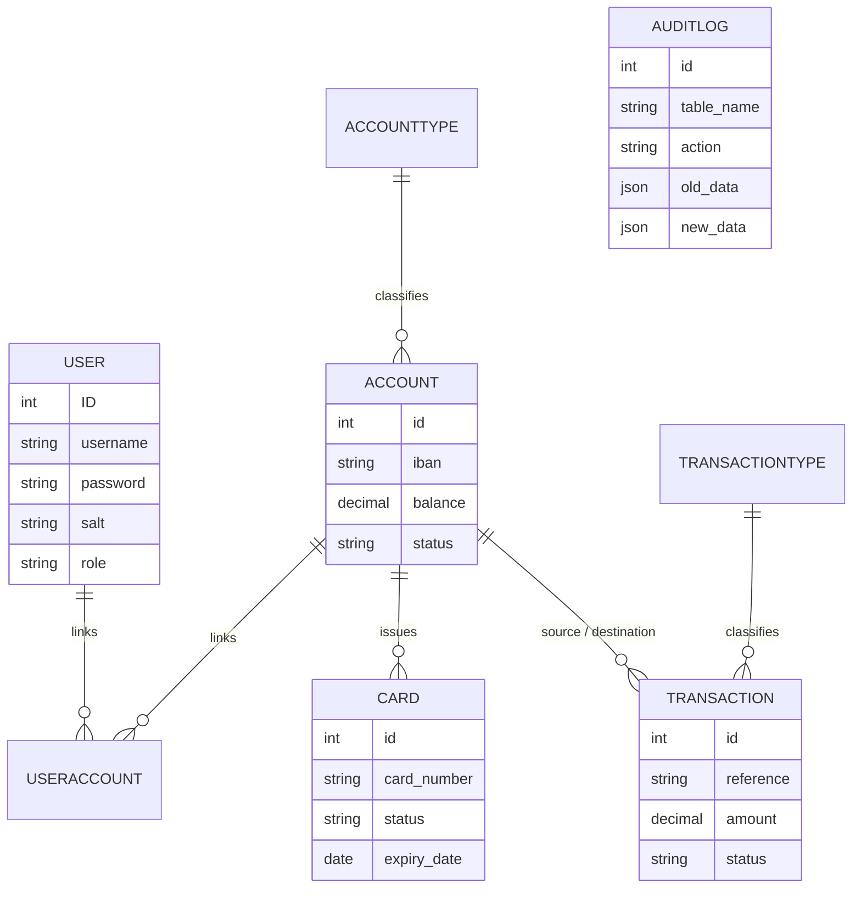

# Internet Banking App

A full-stack internet banking web application. The app implements core online banking functionality- accounts, cards, fund transfers, transaction history, and an admin panel with a strong focus on transactional integrity, auditability, and role-based access control.

## Overview
- **Frontend:** Angular 21 (standalone components, signals)
- **Backend:** Node.js + Express 5 (ESModules)
- **Database:** MySQL (via `mysql2/promise`)

## Features

**End users**
- Registration and login with JWT-based authentication
- Multiple bank accounts per user, including joint (multi-owner) accounts
- Fund transfers between accounts by IBAN, with real-time balance updates
- Deposit, withdrawal, and POS payment simulation
- Full transaction history with direction (credit/debit) and type filtering
- Debit/credit card management - view, block, and unblock cards
- Profile management, including password change

**Administrators**
- User management with per-user account overview and account creation
- Transaction lookup and simulation tools (deposit/withdraw/POS/transfer) by account
- Card lookup and block/unblock across all users
- Paginated audit log with a side-by-side old/new data diff view
- Role-gated navigation - regular users cannot access admin-only routes or screens

## Tech Stack

| Layer | Technology |
|-------|------------|
| Frontend | Angular 21, TypeScript, Bootstrap 5, Font Awesome |
| Backend | Node.js, Express 5, JWT (`jsonwebtoken`) |
| Database | MySQL 9, `mysql2/promise` connection pool |
| Auth | JWT, PBKDF2-SHA512 password hashing |
| Tooling | VS Code, MySQL Workbench / SQLyog, Postman |

## Architecture

**Backend** follows a strict layered architecture:
```
Routes -> Controllers -> Services -> Repositories
```
- **Routes** - URL mapping and middleware chains only
- **Controllers** - HTTP request/response handling, delegates to services
- **Services** - business logic, domain error creation, no direct HTTP or SQL
- **Repositories** - raw SQL queries only, return plain objects

**Frontend** follows Angular's standalone-component model with a `core`/`features`/`shared` split:
- `core/` - singleton services, guards, interceptors, and shared models used app-wide
- `features/` - one folder per screen/domain area (auth, dashboard, accounts, transactions, cards, profile, admin)
- `shared/` - reusable UI components and pipes with no domain-specific logic

State held in Angular **signals** (not a global store library); each domain service exposes a `load()`/`clear()`/`refetch()` triplet with an internal `loaded` cache guard, so any component can safely trigger a load without duplicate HTTP calls.

### Entity-relationship overview



## Project Structure

```
root
├───backend                           # Node backend
|   ├───.env                          # Environment variables (not in repo)
|   ├───config.js                     # Main configuration (environment variables, database connection pool)
|   ├───server.js                     # Server starting point
│   └───app
│       ├───controllers               # HTTP request/response handling layers
│       ├───middleware                # Router middleware
│       ├───repositories              # Database communication layers
│       ├───routes                    # Router URL mapping
│       ├───services                  # Business logic layers
│       └───utils
└───bankingApp                        # Angular frontend
    ├───public
    └───src
        ├───app
        │   ├───core
        │   │   ├───guards            # Route guards
        │   │   ├───interceptors      # HTTP interceptors
        │   │   ├───models            # Shared models
        │   │   └───services          # Singleton services
        │   ├───features              # Feature components
        │   │   ├───accounts
        │   │   ├───admin-panel
        │   │   ├───auth
        │   │   │   ├───login
        │   │   │   └───register
        │   │   ├───cards
        │   │   ├───dashboard
        │   │   ├───profile
        │   │   ├───transactions
        │   │   │   └───transfer-form
        │   │   └───welcome
        │   └───shared                # Reusable components and pipes
        │       ├───components
        │       │   └───sidebar
        │       └───pipes
        └───environments              # Environment variables
```

## Database

**Schema:** `internet_banking`

**Tables:** `User`, `Account`, `AccountType`, `Transaction`, `TransactionType`, `UserAccount` (many-to-many junction, supports joint accounts), `Card`, `AuditLog`

**Views:**
- `vw_account_details` - account info joined with owner and account type
- `vw_user_transactions` - user-scoped transaction history
- `vw_user_cards` - card info with a computed `EXPIRED` status derived from `expiry_date`

**Stored procedures** (all wrapped in `START TRANSACTION` with `FOR UPDATE` row locking for consistency under concurrent access):
- `sp_transfer_funds(from_acc_id, to_acc_id, amount, description)`
- `sp_pos_payout(from_acc_id, to_acc_id, amount, description)`
- `sp_deposit_funds(acc_id, amount, description)`
- `sp_withdraw_funds(acc_id, amount, description)`

Each procedure generates its own transaction reference (`UUID()`) and signals domain-specific errors (`INSUFFICIENT_FUNDS`, `SOURCE_ACCOUNT_CLOSED`, `DESTINATION_ACCOUNT_CLOSED`) via `SIGNAL SQLSTATE '45000'`, which the backend maps to typed HTTP errors.

**Triggers:** `AFTER INSERT`/`AFTER UPDATE` triggers on `User`, `Account`, and `Transaction` populate `AuditLog` automatically, using a `@session_user_id` MySQL session variable set by the application before each write to attribute the change to the acting user.

**Access control:** the application connects as a dedicated `banking_app` MySQL user with `SELECT`/`INSERT`/`UPDATE` and `EXECUTE` privileges only - following the principle of least privilege

## API Overview

| Method | Endpoint | Access |
|--------|----------|--------|
| POST | `/api/auth/login` | Public |
| POST | `/api/auth/register` | Public |
| GET | `/api/auth/me` | Authenticated |
| PUT | `/api/auth/:id` | Self or ADMIN/MOD |
| PATCH | `/api/auth/:id/password` | Self or ADMIN/MOD |
| GET | `/api/auth/users` | ADMIN/MOD |
| GET | `/api/accounts/my` | Authenticated |
| GET | `/api/accounts/:accountId` | ADMIN/MOD |
| GET | `/api/accounts/iban/:iban` | ADMIN/MOD |
| GET | `/api/accounts/user/:userId` | ADMIN/MOD |
| POST | `/api/accounts` | ADMIN/MOD |
| PATCH | `/api/accounts/:accountId/status` | ADMIN/MOD |
| GET | `/api/transactions/my` | Authenticated |
| GET | `/api/transactions/account/:id` | ADMIN/MOD |
| POST | `/api/transactions/transfer` | Authenticated |
| POST | `/api/transactions/withdraw/:accId` | ADMIN/MOD |
| POST | `/api/transactions/deposit/:accId` | ADMIN/MOD |
| POST | `/api/transactions/pos` | ADMIN/MOD |
| GET | `/api/cards/my` | Authenticated |
| PATCH | `/api/cards/:cardId/status` | Authenticated (own card)/ADMIN/MOD |
| GET | `/api/audit` | ADMIN (paginated) |

Self-service endpoints never take another user's ID in the path - the acting user is always resolved from the JWT. Admin equivalents are separate, explicitly role-guarded routes.

## Getting Started

### Prerequisites
- Node.js
- MySQL 9.x
- Angular CLI

### Environment variables (`backend/.env`)

```
PORT=8080
DB_HOST=localhost
DB_PORT=3306
DB_USER=banking_app
DB_PASS=<password>
DB_NAME=internet_banking
JWT_SECRET=<secret>
JWT_EXPIRES_IN=1d
```

### Running in development

```bash
# Backend
cd backend
npm install
npm run dev    # http://localhost:8080

# Frontend
cd bankingApp
npm install
ng serve       # http://localhost:4200
```

CORS is handled manually in `server.js` during development; Angular proxying is not configured.

### Production build

```bash
cd bankingApp
ng build

# Copy the build output into the backend's static folder
cp -r dist/bankingApp/browser/* ../backend/public/app/
cd ../backend
npm start      # serves both API and Angular app on http://localhost:8080
```
